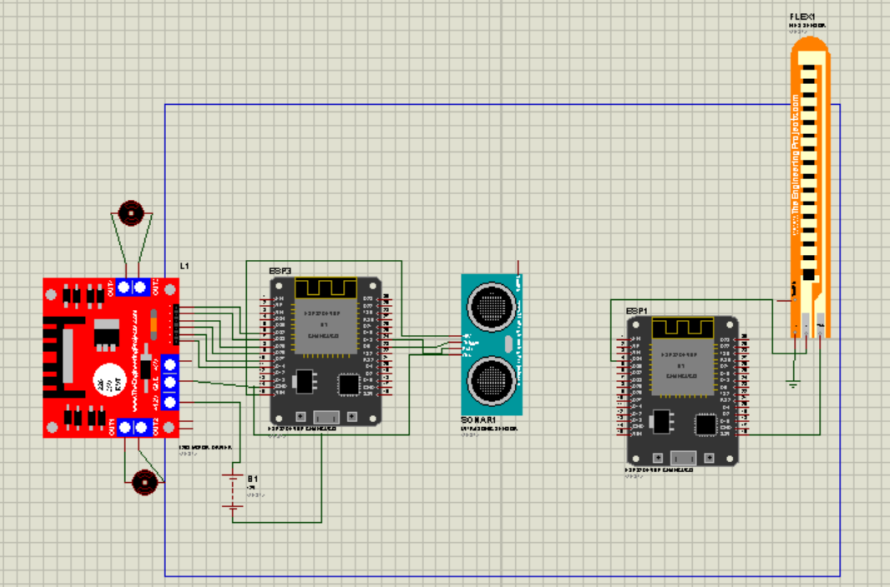
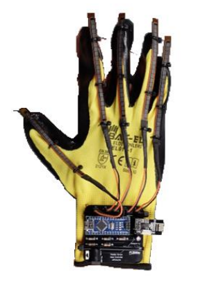

# Gesture-Controlled Robot

This project demonstrates the design and implementation of a gesture-controlled robot using ESP32 microcontrollers, flex sensors, and FreeRTOS for real-time task prioritization. The system allows intuitive control of a robotic car through hand gestures, with obstacle detection ensuring safe operation.

## Features
- **Gesture Control**: Use a glove with flex sensors to control the robot's movement.
- **Obstacle Avoidance**: Ultrasonic sensor detects obstacles and overrides gesture commands to prevent collisions.
- **FreeRTOS Integration**: Real-time task prioritization ensures efficient and safe operation.

## Hardware Components
- ESP32 Microcontrollers (x2)
- Flex Sensor
- Ultrasonic Sensor (HC-SR04)
- DC Motors
- Battery
- Robotic Car Chassis

#### (used 1 flex sensor in the project, but multiple flex sensors can be used as shown in the image to improve robot control) ####

## Software Components
- Arduino IDE
- FreeRTOS for ESP32
- WiFi for communication between server and client ESP32

## Setup Instructions
1. **Upload Code**:
   - Upload `server_esp32.ino` to the ESP32 connected to the flex sensor.
   - Upload `client_esp32.ino` to the ESP32 mounted on the robotic car.

2. **Connect Hardware**:
   - Connect the flex sensor to the server ESP32.
   - Connect the ultrasonic sensor and motors to the client ESP32.

3. **Power On**:
   - Power both ESP32 devices and ensure they connect to the same WiFi network.

4. **Control the Robot**:
   - Use the glove to make gestures and control the robot's movement. The robot will stop/turn automatically if an obstacle is detected.

## Code Structure
- `server.ino`: Handles flex sensor input and sends commands to the client.
- `client.ino`: Controls the robot's motors and implements obstacle avoidance.

## Future Enhancements
- Expand gesture library for more complex controls.
- Implement path planning algorithms for autonomous navigation.
- Use advanced wireless protocols like ZigBee or LoRa for extended range.
